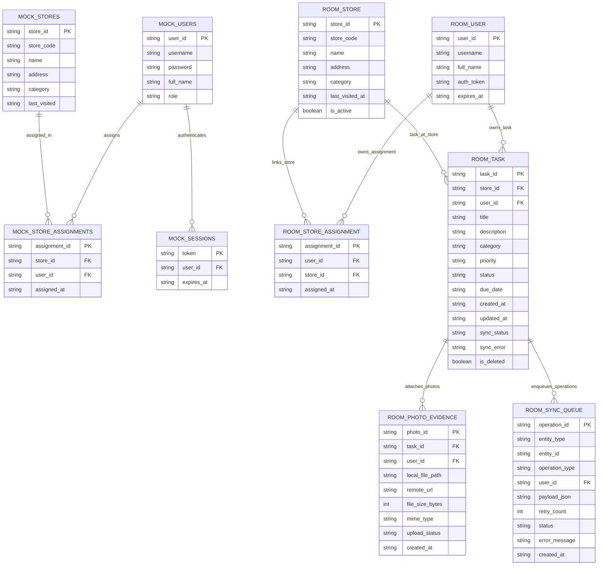

# StoreVisit Database Diagram

```mermaid
erDiagram
    %% =========================================================================
    %% SECTION 1: IMPLEMENTED DAY 15 MOCK DATABASE (mock_server.db - In-Process SQLite)
    %% =========================================================================
    MOCK_USERS ||--o{ MOCK_STORE_ASSIGNMENTS : assigns
    MOCK_STORES ||--o{ MOCK_STORE_ASSIGNMENTS : assigned_in
    MOCK_USERS ||--o{ MOCK_SESSIONS : authenticates

    MOCK_USERS {
        string user_id PK
        string username
        string password
        string full_name
        string role
    }

    MOCK_STORES {
        string store_id PK
        string store_code
        string name
        string address
        string category
        string last_visited
    }

    MOCK_STORE_ASSIGNMENTS {
        string assignment_id PK
        string store_id FK
        string user_id FK
        string assigned_at
    }

    MOCK_SESSIONS {
        string token PK
        string user_id FK
        string expires_at
    }

    %% =========================================================================
    %% SECTION 2: PLANNED ROOM APP LOCAL DATABASE (AppDatabase.db - Days 16-19)
    %% =========================================================================
    ROOM_USER ||--o{ ROOM_STORE_ASSIGNMENT : owns_assignment
    ROOM_STORE ||--o{ ROOM_STORE_ASSIGNMENT : links_store
    ROOM_USER ||--o{ ROOM_TASK : owns_task
    ROOM_STORE ||--o{ ROOM_TASK : task_at_store
    ROOM_TASK ||--o{ ROOM_PHOTO_EVIDENCE : attaches_photos
    ROOM_TASK ||--o{ ROOM_SYNC_QUEUE : enqueues_operations

    ROOM_USER {
        string user_id PK
        string username
        string full_name
        string auth_token
        string expires_at
    }

    ROOM_STORE {
        string store_id PK
        string store_code
        string name
        string address
        string category
        string last_visited_at
        boolean is_active
    }

    ROOM_STORE_ASSIGNMENT {
        string assignment_id PK
        string user_id FK
        string store_id FK
        string assigned_at
    }

    ROOM_TASK {
        string task_id PK
        string store_id FK
        string user_id FK
        string title
        string description
        string category
        string priority
        string status
        string due_date
        string created_at
        string updated_at
        string sync_status
        string sync_error
        boolean is_deleted
    }

    ROOM_PHOTO_EVIDENCE {
        string photo_id PK
        string task_id FK
        string user_id FK
        string local_file_path
        string remote_url
        int file_size_bytes
        string mime_type
        string upload_status
        string created_at
    }

    ROOM_SYNC_QUEUE {
        string operation_id PK
        string entity_type
        string entity_id
        string operation_type
        string user_id FK
        string payload_json
        int retry_count
        string status
        string error_message
        string created_at
    }
```

